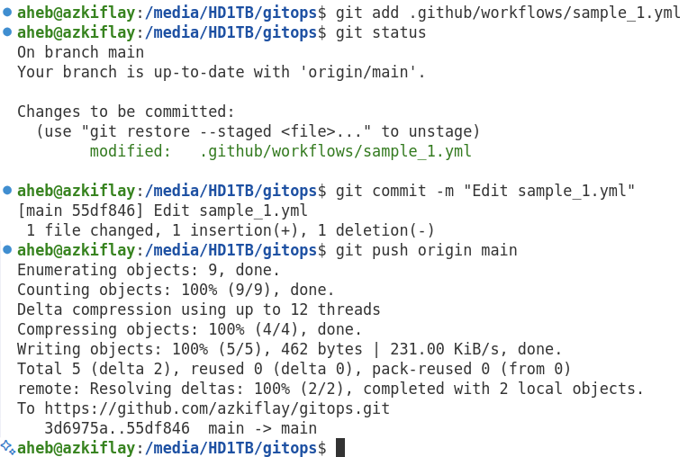

**Contents** </br>
- [Introduction](#introduction)
- [Practicals](#practicals)
  - [Install GitHub CLI](#install-github-cli)
  - [VS Code GitHub Actions](#vs-code-github-actions)
- [Components of GitHub Actions](#components-of-github-actions)
- [References](#references)

# Introduction
GitHub Actions is an end-to-end workflow automation platform that handles continuous integration and continuous delivery (CI/CD) aspect for Git and GitHub. As a CI/CD automation tools, GitHub Actions helps deliver software as soon as possible to its users. While GitHub allows collaboration on writing software code, GitHub Actions enables fast delivery of the software to users.

Put another way, GitHub Actions is GitHub’s CI/CD platform that is used to automate workflows such as *running tests**, *building and deploying applications*, *running security scans*, and *automating repetitive tasks (e.g., labeling issues, sending notifications)*. These workflows are defined in YAML files inside "*.github/workflows/*".

Before GitHub Actions was available, other tooling (e.g., Jenkins, Travis CI) needed to be integrated on GitHub to facilitate CI/CD. While GitHub Actions is one of the popular tools, there are other alternatives such [Azure DevOps](https://azure.microsoft.com/en-us/products/devops), [Jenkins](https://www.jenkins.io/), [Travis CI](https://www.travis-ci.com/), and [CircleCI](https://circleci.com/). The advantage of GitHub Actions is that its is natively integrated to other GitHub components.

GitHub Actions are triggered by events in GitHub such as **pull** and **push** requests, leading to automated CI/CD workflows. GitHub Actions defines what should happen following *push* and *pull* requests (e.g., build code on *push*, and *release code* if build is successful). CI/CD code files for GitHub Actions can be stored on GitHub alongside the software source code. In other words, GitHub will contain both source codes for the application software as well as the CI/CD automation.

A typical flow in Event (e.g., push, pull) occurs --- Trigger **workflow** definition --> starts **jobs** on designated systems (**runners**). **Jobs**: steps for a predefined **action** or run a Shell command.
- **Actions Marketplace**: repository to publish and share *actions*.
- 

For self-hosted runners (systems) and for public repositories, GitHub Actions is free.
# Practicals
## Install GitHub CLI
This avoids managing tokens manually.
```bash
    sudo apt install gh # Install GitHub CLI if you don’t have it
    gh auth login # # Log in interactively (opens browser)
    # Note: GitHub.com -- HTTPS -- Authenticate with GitHub credentials -- Login with a web browser --> Copy one-time code to authenticate on GitHub.com.
```
<p align="left">

</p>
<p align="left"><strong>Figure 1:</strong> Logging using GitHub CLI ($gh auth login) </p>

Create workflows under **.github/workflows**
```bash
cd gitops
mkdir .github
cd .github
mkdir workflows
cd .github/workflows
nano build-sample.yml
cd ../../
git add .github/
git commit -m "Create workflows."
git push origin main
```

The above "*git push origin main*" is one event that can trigger execution of the workflow. Figure 2 shows execution of the workflow on GitHub Actions following the "*push*" event, resulting in **continuous integration (CI)** of the new code changes with the existing one on the GitHub repository.
<figure>
  <table>
    <tr>
      <td>
        
      </td>
      <td>
        
      </td>
    </tr>
  </table>
  <figcaption><strong>Figure 2: </strong> Push event vs Workflow on GitHub Actions </figcaption>
  </figure>


## VS Code GitHub Actions

# Components of GitHub Actions
- Events that trigger automation: occurs due to a change on a GitHub repository, which is identified by a Secure Hashing Algorithm SHA1 value. 
- Parts that achieve the automation: 
  - **workflows** directory that contains action files to be executed in response to events.
  - Workflows are files in YAML format inside **.github/workflows** directory within the GitHub repository.
  - In each workflow, there are **jobs** that can run in parallel when the workflow is triggered.
  - Each job consists of **steps**, which execute shell commands or GitHub actions.
  - **Runner**: a server that executes steps in a job.

**Action**: the smallest reusable unit in GitHub Actions. Like a function in programming languages, *action* does one specific job. For example, *checkout a repository*, *run a command*, and *deploy an application to AWS* are actions.

**Types of Actions**: There are three types of actions.
- (1) Marketplace Actions: public reusable actions created by the GitHub community. For example, the [actions/checkout@v4](https://github.com/actions/checkout) checks-out a repository under $GITHUB_WORKSPACE. A full searchable list of public actions is available [here](https://github.com/marketplace?type=actions). For instance, if you search for "*EKS*", you will get Amazon EKS related results. One of them is "*EKS on Fargate*", which can be used to manage the lifecycle of an [EKS cluster](https://aws.amazon.com/eks/) on [AWS Fargate](https://aws.amazon.com/fargate/).
- (2) Custom Actions: Project-specific action file in YAML format inside a repository (.github/actions/sample.yaml)
- (3) Docker/JavaScript Actions: Custom actions written in JavaScript or inside a Docker to do a specific thing.

**Action Components**: *name:*, *description:*, *inputs:*, *outputs:*, and *runs:* blocks. For example, the action file in **.github/actions/action.yaml** contains these blocks except *outputs:* block. This is an example of custom action. This action file can be referenced in a workflow using the **uses:** block. The values in the **inputs:** block defines the link between the action and workflow.

Ways to create a workflow:
- (1) Use the Actions tab on the GitHub code repo and use one of the suggested workflows for it.
- (2) Create workflow file in "**.github/workflows/**" outside of GitHub

A workflow can be triggered from inside the web interface of the GitHub repository or from outside.
Figure 3 displays example workflow triggers by committing changes from the web interface, and by **git push** event.
<figure>
  <table>
    <tr>
      <td>
        
      </td>
      <td>
        
      </td>
      <td>
        
      </td>
      <td>
        
      </td>
    </tr>
  </table>
  <figcaption><strong>Figure 3: </strong> Push event vs Workflow on GitHub Actions </figcaption>
  </figure>


# References
* Learning GitHub Actions by Brent Laster (O’Reilly). Copyright 2023 Tech Skills Transformations, LLC, 978-1-098-13107-4.
* https://github.com/techupskills/learning-github-actions
* 